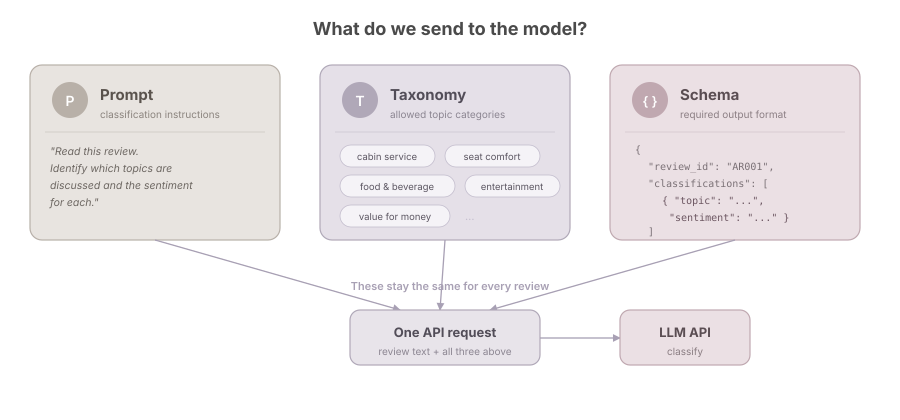
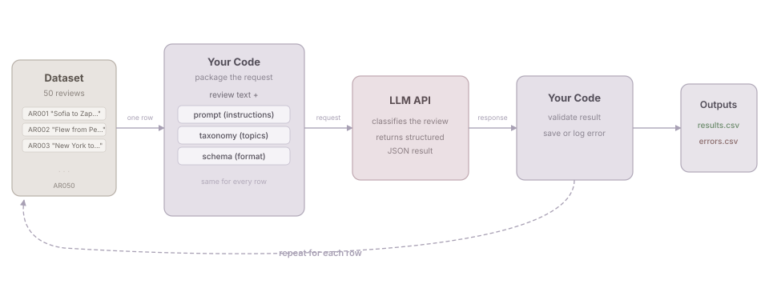
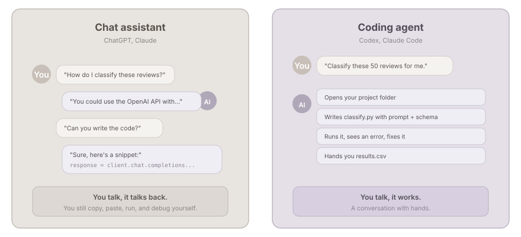
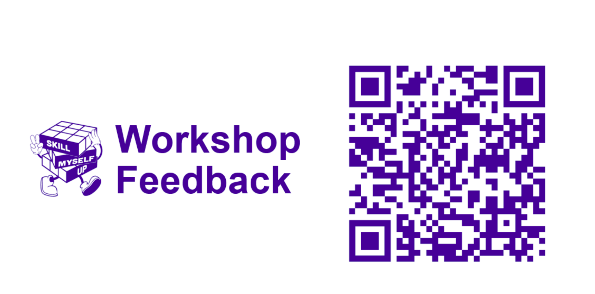

# Welcome

## What we are doing today

We will take a **real text classification task** and turn it into a small, inspectable workflow.

. . .

By the end, you should be able to:

- describe when chat is enough, and when an API-based workflow helps;
- use a coding agent to build and test a classification pipeline;
- inspect model outputs instead of simply accepting them;
- identify where human judgement still matters.

::: {.notes}
Keep this brief. The workshop is not primarily about becoming a Python programmer or mastering one model provider. It is about developing a practical mental model for an LLM-assisted research workflow.
:::

## Today's plan

:::: {.agenda}

::: {.agenda-block .agenda-listen}
[Part 1 · Listen]{.agenda-tag}

**Why and what**

- The dataset
- The classification task
- From chat to workflow
- The tools
:::

::: {.agenda-block .agenda-do}
[Part 2 · Do]{.agenda-tag}

**Hands-on with a coding agent**

- 5-min set-up check
- Brief the agent on the task
- Build and test on 3 reviews
- Inspect and refine the prompt
- Scale up to 50 and compare
:::

::: {.agenda-block .agenda-reflect}
[Part 3 · Reflect]{.agenda-tag}

**Wrap up**

- Quick quiz on Menti [bring your phone]{.agenda-note}
- Take-aways
- Q&A and feedback
:::

::::

::: {.notes}
Set expectations: some talk first, then most of the time is hands-on. Mention the short Menti quiz at the end so people are not surprised.
:::

## How we will work

<div class="collaboration-loop">
<span class="human-step">Give context</span>
<span class="flow-arrow">→</span>
<span class="human-step">Ask</span>
<span class="flow-arrow">→</span>
<span class="agent-step">Build</span>
<span class="flow-arrow">→</span>
<span class="agent-step">Run</span>
<span class="flow-arrow">→</span>
<span class="human-step">Check</span>
<span class="flow-arrow">→</span>
<span class="agent-step">Revise</span>
<span class="loop-arrow">↺</span>
</div>

<div class="step-legend">
<span class="human-key">Human-led</span>
<span class="agent-key">Agent-led</span>
</div>

. . .

**Not one perfect prompt, but an iterative conversation with the agent.**

We provide direction and judgement. The agent builds, runs and revises the workflow.

::: {.notes}
The human and the agent contribute different things.
We define the task, provide context, ask questions and inspect the outputs. The agent works with the project files, builds the workflow, runs it and implements revisions.
This is not a rigid hand-off. Checking the output often leads to more context, a better question or a change in direction, and the loop begins again.
:::

# The dataset

## What are we working with?

Airline passenger reviews from [Skytrax](https://www.airlinequality.com/), published on Kaggle by Sujal Suthar.

<div style="font-size: 0.7em; color: #666;">

Source: [Airline Reviews Dataset](https://www.kaggle.com/datasets/sujalsuthar/airlines-reviews) on Kaggle

</div>

. . .

<div style="font-size: 0.8em;">

| | |
|---|---|
| **Reviews** | 8,100 passenger reviews |
| **Airlines** | 10 carriers — Turkish Airlines, Qatar Airways, Emirates, Singapore Airlines, Air France, Cathay Pacific, and others |
| **Cabin class** | Economy (68%), Business (26%), Premium Economy (5%), First (1%) |
| **Traveller type** | Solo leisure, couple, family, business |
| **Period** | Multiple years of reviews |

</div>

::: {.notes}
Credit the dataset source. The original data was scraped from Skytrax (airlinequality.com) and compiled on Kaggle by Sujal Suthar. We use a 50-review subset for this workshop.
:::

## What does each row look like?

Each review is a **free-text narrative** covering multiple aspects of the flight.

<div style="font-size: 0.55em; line-height: 1.5;">

| review_id | Airline | Review (excerpt) |
|-----------|---------|-------------------|
| AR002 | Qatar Airways |  *"Check-in was good, seats were comfortable but restricted… Disappointed in the food… Staff were very good but could have come round more often…"* |
| AR008 | Singapore Airlines | *"The service was excellent… meals were excellent, inflight entertainment was excellent, and the cleanliness in the washrooms were perfect…"* |
| AR007 | Emirates | *"Rude staff that treat your special meal as a nuisance… Take the blankets and headphones 30 minutes before landing to save time and costs."* |

</div>

. . .

Notice: a single review can mention **multiple topics** with **different sentiments**.

::: {.notes}
Let participants read the excerpts. Point out that AR002 mentions check-in (positive), seats (mixed), food (negative), and staff (positive) — all in one paragraph. This is what makes classification more than a simple positive/negative call.
:::

## The full dataset has rich metadata

<div style="font-size: 0.85em;">

::: {.columns}
::: {.column width="48%"}
### Structured fields

- **Airline** — which carrier
- **Route** — origin and destination
- **Class** — economy, business, first
- **Type of Traveller** — solo, family, business
- **Month Flown** and **Review Date**
- **Verified** — confirmed trip or not
:::

::: {.column width="48%"}
### Numeric ratings (1–5)

- Seat Comfort
- Staff Service
- Food & Beverages
- Inflight Entertainment
- Value For Money
- **Overall Rating** (1–10)
- **Recommended** — yes / no
:::
:::

</div>

. . .

But today we focus on the **free-text review** — the unstructured part that resists simple counting.

::: {.notes}
Briefly walk through the columns. Emphasise that the numeric ratings are already structured — our classification challenge is the review text, which can contain multiple topics and mixed sentiments that the star ratings do not capture.
:::

## Our workshop subset

For today, we work with **50 reviews**, simplified to two columns:

```text
review_id,  review_text
AR001,      "Sofia to Zaporizhia via Istanbul. I used Turkish airlines..."
AR002,      "Flew from Perth to Doha then onto Munich with Qatar Airways..."
AR003,      "New York to Paris. This was one of the many Air France..."
...
```

. . .

**Why simplify?**

- Removes the crutch of existing ratings
- Forces us to read the text and make our own judgements
- Mirrors many real-world scenarios where only unstructured text is available

::: {.notes}
Point out that stripping the metadata is a deliberate pedagogical choice. In a real project, the structured fields could serve as useful cross-checks.
:::

## How would you analyse this without AI?

::: {.columns}
::: {.column width="48%"}
### Traditional content analysis

1. **Read** each review carefully
2. **Develop** a coding scheme (topics, sentiments)
3. **Train** multiple coders on the scheme
4. **Code** each review independently
5. **Measure** inter-rater reliability
6. **Reconcile** disagreements
7. **Tabulate** and analyse
:::

::: {.column width="48%"}
### The reality

- Time-intensive: days to weeks for 50 reviews
- Scales poorly to hundreds or thousands
- Coding fatigue affects consistency
- But: builds **deep familiarity** with the data
- And: forces you to **confront ambiguity** early
:::
:::

::: {.notes}
Ask participants if any of them have done manual content analysis or qualitative coding. This is a shared reference point for researchers across disciplines.
:::

## The tension we are trying to resolve

<div style="font-size: 0.95em;">

| | Manual coding | LLM-assisted workflow |
|---|---|---|
| **Speed** | Slow | Fast |
| **Consistency** | Depends on coder fatigue | Depends on prompt and model |
| **Transparency** | Codebook + training | Prompt + taxonomy + inspection |
| **Scale** | Dozens to hundreds | Hundreds to thousands |
| **Judgement** | Human throughout | Human at design and evaluation |

</div>

. . .

We are not replacing the researcher.

We are **changing where and how the researcher's judgement is applied**.

::: {.notes}
This is the key framing. The workshop is about making the human contribution more deliberate — designing the task specification, inspecting outputs, and evaluating disagreements — rather than removing it.
:::

# 1. Start with the task

## One review often includes more than one judgement

> The cabin crew were helpful, but the seat was uncomfortable and the meal was disappointing.

. . .

::: {.columns}
::: {.column width="48%"}
### What can we identify?

- Cabin service
- Seat comfort
- Food and beverage
:::

::: {.column width="48%"}
### What sentiment applies?

- Positive
- Negative
- Negative
:::
:::

. . .

**Already, this is more than “positive or negative?”**

::: {.notes}
Ask participants to classify the sentence before showing the answer. Point out that this is aspect-based sentiment classification: one document can contain several aspects, each with a different sentiment.
:::

## Where might people disagree?

- Is a topic actually present, or only implied?
- Does a comment fit one category or another?
- Is the sentiment negative, mixed or simply descriptive?
- Should the case be flagged for review?

::: {.notes}
This prepares participants for taxonomy boundaries, model disagreement and human review. Avoid framing every disagreement as an error.
:::

## One review is manageable. What about hundreds?

For each review, we want to:

1. apply the same decision rules consistently;
2. capture the result in a structured format;
3. know what failed and why;
4. rerun the process after revising the rules;
5. identify cases that need closer inspection.

::: {.notes}
Walk through briefly: (1) = the prompt and taxonomy, (2) = structured JSON output, (3) = error logging — important because silent failures hide data loss, (4) = iterative refinement of prompt/taxonomy, (5) = human-in-the-loop review. These five things are what separate "asking a chatbot" from "running a workflow."
:::

# 2. From chat to workflow

## Chat is a good place to explore

ChatGPT or Claude can help us:

- explore the task;
- test an initial taxonomy;
- try a prompt on a few examples;
- discuss ambiguous cases;
- improve the instructions.

. . .

<div class="callout-box">

**Chat is useful while we are still figuring out the task.**

</div>

::: {.notes}
Do not frame chat as inferior. It is a useful exploratory environment. The question is what happens when the task needs to be repeated systematically.
:::

## But manual chat does not make a workflow

::: {.columns}
::: {.column width="45%"}
### One-off interaction

Copy a review
→ write or paste a prompt
→ inspect the answer
→ copy the result
→ repeat
:::

::: {.column width="10%"}
<div class="big-arrow">→</div>
:::

::: {.column width="45%"}
### Repeatable workflow

Read a row
→ apply stored instructions
→ call the model
→ validate the response
→ save output or error
:::
:::

. . .

**Everything lives in the project folder — the data, the instructions, and the outputs. You can inspect it, rerun it, and hand it to someone else.**

::: {.notes}
The key difference is not the model — it is that the workflow is a project folder someone can open and understand. Data, prompt, taxonomy, schema, code, and outputs are all there. The coding agent works inside this folder. Nothing is trapped in a chat window. Avoid saying an API automatically makes research reproducible — model outputs can still vary, but the process is documented and verifiable.
:::

## "Why not just upload the file to ChatGPT?"

You can! And for a few reviews, it works fine.

. . .

But try it with 50 or more, and ask yourself:

- Did it process **every** row? How do you check?
- Can you control the **output format** for every row?
- If row 37 went wrong, can you **rerun just that one**?
- Can you change the instructions and **rerun everything**?
- Can you hand the whole process to someone else to **verify**?

. . .

We need a way for our **code** to talk to the model — one row at a time, same instructions, every result saved.

That is what an API does.

::: {.notes}
This is the most important bridge slide. Many participants will be thinking exactly this question. Validate the instinct — chat is great for exploration — but show why it breaks down at scale. The five bullet points are things they will experience in the hands-on if they try the chat route first.
:::

## What is an API?

A way for one piece of software to ask another service to do something.

. . .

You already use APIs without knowing it:

- **Grab** shows a map → it asks Google Maps' API for the map
- **"Login with Google"** on a website → it asks Google's API to verify you
- **Weather widget** on your phone → it asks a weather service's API for the forecast

. . .

The pattern is always the same:

**Request** (ask in a specific format) → **Response** (get back a structured answer)

::: {.notes}
Keep this very short. The point is just to demystify the word "API". It is not a scary developer thing, it is something they already interact with daily. Don't linger here.
:::

## What is an LLM API?

Same idea, but the service is a language model.

::: {.columns}
::: {.column width="48%"}
### ChatGPT / Claude (the app)

- Chat interface built for you
- Manages conversation memory
- You type, it responds
- Result lives in the chat window
:::

::: {.column width="48%"}
### LLM API (the interface)

- No interface. Your code talks to the model
- Each request is independent
- You control the instructions, input, and output format
- Result goes wherever your code puts it
:::
:::

. . .

**Same model underneath. But your code is in control**, so you can process one row at a time, with the same instructions, and save every result.

::: {.notes}
Emphasise: the model is the same. ChatGPT is a product built on top of the API. Using the API does not give you a "better" model. It gives you control over the process. This is why it fits into a workflow.
:::

## What do we send to the model?



::: {.notes}
Walk through the three cards. Prompt = the instructions telling the model what to do. Taxonomy = the allowed categories it can pick from. Schema = the format the answer must follow. These three things together are the “task specification”. They stay the same for every review. Participants will see the actual files in the hands-on.
:::

## The workflow



::: {.notes}
Walk through the diagram left to right. The dataset is the input. The code reads one row, attaches the prompt, taxonomy, and schema, sends it to the LLM API, gets back a structured JSON result, validates it, and saves it. Then it moves to the next row. Repeat for all 50 reviews. Results and errors are saved separately.
:::

## What should one result look like?

```json
{
  "review_id": "AR001",
  "aspects": [
    {
      "topic": "cabin_crew_service",
      "sentiment": "positive"
    },
    {
      "topic": "seat_and_cabin_comfort",
      "sentiment": "negative"
    }
  ],
  "review_required": false,
  "review_reason": ""
}
```

A good result is not only plausible to read.

It must also be **valid enough for the next step in the workflow**.

::: {.notes}
This connects the workflow diagram to what actually comes back. Explain why review_id, controlled topics and review_required matter downstream.
:::

# 3. Understand the tools

## Chat assistant vs coding agent



. . .

The important difference is not which model is smarter. It is **how the tool connects to your project**.

::: {.notes}
Aaron's earlier workshop may have introduced this, but do not assume everyone attended or completed it. Keep the distinction practical rather than product-marketing focused.
:::

## Who is doing what?

<div class="role-flow">

### You
Define the task, taxonomy and review criteria

↓

### Coding agent
Build and operate the workflow

↓

### LLM API
Classify each review

↓

### You
Inspect outputs, errors and disagreements

</div>

::: {.notes}
This is the centre of the workshop. The coding agent is not the classifier, the API is not the coding agent, and neither replaces the researcher's substantive judgement.
:::


# 4. Hands-on

## First: a 5-minute set-up check

1. The `airline-review-workshop` folder is downloaded and **unzipped**
2. Your coding agent (Claude Code, Codex, ...) is open **in that folder**
3. Python works. Ask your agent:

::: {.prompt-box}
Check whether Python 3.10 or above is installed on this computer. If not, help me install it.
:::

**Stuck?** Raise your hand, or pair up with your neighbour.

::: {.notes}
Give 5 minutes. Walk around. Common issues: Python not on PATH (reopen the agent / terminal, or restart), folder still zipped, agent opened in the wrong folder. People without an agent: pair them up.
:::

## Your workshop package

```text
airline-review-workshop/
├── README.md
├── requirements.txt
├── .env.example
├── classification-rule/
│   ├── classification_prompt.md
│   ├── taxonomy.yaml
│   └── output_schema.json
├── data/
│   └── airline_reviews_sample_50.csv
├── compare.py
├── reference_set_final.csv
└── output/
```

The classification rules, the data, and the comparison script are ready. The only missing piece is `classify.py`. That is what we will build.

::: {.notes}
Walk through the folder briefly. Remind participants: do not share your .env file. The API key has a spending cap, so use --limit 3 while developing.
:::

## Step 0: Set up the environment

::: {.prompt-box}
Set up this project for me. Install the Python dependencies from requirements.txt. Then copy .env.example to .env.
:::

After this, add your API key to `.env`.

. . .

If you have your own API key, use it. Otherwise, use the shared key provided.

::: {.notes}
Give participants a moment to set up. Help anyone stuck on Python/pip issues. Remind them the model is claude-haiku-4-5-20251001 (cheapest option).
:::

## Step 1: Let the agent understand the task

::: {.prompt-box}
Read the project files in this folder. Tell me:

- what dataset we have
- what the classification task is
- what output format is expected

Do not write any code yet.
:::

. . .

Check the agent's summary together. Does it match what we discussed?

::: {.notes}
Live demo: paste the prompt, show the agent's response. Give participants a moment to do the same and compare. This establishes that talking to the agent before coding is a good habit.
:::

## Step 2: Build classify.py and test on 3 reviews

::: {.prompt-box}
Build classify.py that reads the classification rules from classification-rule/, sends each review to the Anthropic API using claude-haiku-4-5-20251001, validates the output against the schema, and saves results. Run it on the first 3 reviews only.
:::

. . .

Watch the terminal output. You should see something like:

`[1/3] Classifying AR001... ok`

::: {.notes}
Live demo: paste the prompt, let the agent build and run. The terminal output should show progress, successes, errors, and where results are saved. Give participants time to follow along. If someone's build fails, the agent can debug it.
:::

## Step 3: Inspect the results

::: {.prompt-box}
Open output/results.csv and show me the classifications for the 3 reviews we just ran.
:::

. . .

Look at each result together:

- Do the **topics** match what you would pick?
- Does the **sentiment** make sense for each topic?
- Is anything **missing** or **surprising**?

. . .

A result can be valid JSON and still be a poor classification. This is where your judgement matters.

::: {.notes}
Live demo: show the CSV, pick one review, compare the classification to the original review text. Ask participants what they agree or disagree with.
:::

# 5. Refine, scale up, compare

## Not happy? Refine the prompt.

If something is off in the results, edit `classification-rule/classification_prompt.md`.

::: {.prompt-box}
I updated classification_prompt.md. Re-run classify.py on the same 3 reviews and show me what changed.
:::

. . .

This is an iterative process. Change the instructions, re-run, compare.

But do not overfit to these 3 reviews. A prompt that works well on unseen reviews is better than one tuned perfectly for 3.

::: {.notes}
Live demo: show one result that is not ideal, walk through why, edit the prompt together, re-run. Emphasise: we are improving the instructions, not memorising correct answers for specific reviews.
:::

## Scale up: run all 50 reviews

When the prompt looks solid:

::: {.prompt-box}
Run classify.py on all 50 reviews. Show me a summary when done.
:::

. . .

Check the summary: how many succeeded? Any errors?

::: {.prompt-box}
Open results.csv and show me a few rows. Are there any results that look wrong?
:::

::: {.notes}
Live demo: run all 50, show the terminal summary, open the CSV and skim. Give participants time to do the same.
:::

## Compare with the reference set

`reference_set_final.csv` should be in your project folder (if missing, download it again from the GitHub repo). Then:

::: {.prompt-box}
Run compare.py to compare my results with the instructor reference set. Show me where we disagree and why.
:::

. . .

The reference set covers 15 of the 50 reviews. It is not a golden standard. It is a starting point for discussion.

- Where do you agree with the model over the reference?
- Where does the reference seem more reasonable?
- Are there cases where **both are defensible**?

::: {.notes}
Live demo: run compare.py, show the output. Pick 2-3 disagreements and discuss as a group. compare.py also saves comparison.csv for easy viewing in Excel.
:::

## Quick check {.center}

:::: {.columns}
::: {.column width="45%"}
{width="85%"}
:::
::: {.column width="55%"}
<br>

Go to **menti.com**

Code: **5570 3604**
:::
::::

::: {.notes}
~8-10 min. 5 MCQs + 1 open question (where could you use this in your own work?). Use the open answers as a lead-in to wrap-up.
:::

# 6. Wrap up

## What did we actually do today?

1. Looked at the data and understood the classification task
2. Told a coding agent what to build, without writing code ourselves
3. Inspected the results, refined the prompt, re-ran
4. Scaled up and compared with a reference set

. . .

Everything lives in the project folder. The data, the instructions, the code, and the outputs. You can inspect it, rerun it, and hand it to someone else.

::: {.notes}
Keep this grounded. Point back to the actual files they just worked with.
:::

## What can you take home?

**The project folder.** It is a reusable starting point.

. . .

To adapt it to your own task:

- Swap the data (any CSV with an ID and a text column)
- Rewrite the prompt for your domain
- Adjust the taxonomy and schema
- Run the same workflow

. . .

The structure stays the same. The content changes.

::: {.notes}
Emphasise that the folder structure, the classify.py pattern, and the compare.py pattern are reusable. They do not need to start from scratch next time.
:::

## One more thing: purpose-built classification models

Today we used a general-purpose LLM (Claude Haiku) for classification. It works, but it is also generating text, parsing JSON, and doing much more than we need.

. . .

**Jev** (TypeSafe AI, released last week) is a "System 1" model that *only* makes decisions. No text generation. You give it options, it picks one.

- **$0.042 per million input tokens** (output is free)
- Up to 200x cheaper than general-purpose LLMs for classification
- Same workflow, swap the model

. . .

The trade-off: a general-purpose LLM can explain *why* it chose a label (useful when you need justification or human review). A classification-only model just gives you the answer. Pick based on what you need.

::: {.notes}
This is optional and brief. Just plant the seed that purpose-built models exist for classification tasks. Link: typesafe.ai
:::

## Questions and discussion {.nostretch}

- What kind of text data do you work with?
- Where could a similar workflow help?
- What would be the hardest part to specify for your task?

{width="58%" fig-align="center"}

# Appendix

## Appendix: LLM-as-a-judge

A related idea: use another LLM to evaluate the first LLM's classifications.

For example, ask a second model: "Is this classification supported by the review text?"

This can help spot problems at scale, but the judge is also a model, not an objective answer key. It works best when you give it **specific criteria** rather than asking "is this good?"

Not something we cover in today's workshop, but worth exploring if you scale this up to thousands of reviews.

## Appendix: A simple mental model

```text
DATA
  ↓
TASK SPECIFICATION
  taxonomy + instructions + schema
  ↓
WORKFLOW
  input → API call → validation → storage
  ↓
EVALUATION
  technical checks + reference comparison + error analysis
  ↓
REVISION
  data, taxonomy, prompt, code or review process
```

## Appendix: Common failure modes

::: {.columns}
::: {.column width="48%"}
### Technical

- Missing or exposed API key
- Wrong file path
- Dependency mismatch
- Rate limit or failed request
- Invalid or truncated JSON
- Silent loss of failed records
:::

::: {.column width="48%"}
### Substantive

- Hallucinated topic
- Missed aspect
- Wrong taxonomy boundary
- Sentiment attached to wrong topic
- Duplicate topic
- Over- or under-use of review flag
:::
:::

## Appendix: If the live build fails

The learning can continue with prepared outputs:

1. inspect the result structure;
2. run validation locally;
3. compare with the reference set;
4. diagnose disagreement;
5. propose changes to the task specification.

. . .

A failed API call should not cancel the evaluation exercise.

## Appendix: Terms used today

**LLM**  
A model that can generate and analyse language.

**API**  
An interface that allows software to send requests to a service and receive responses.

**Coding agent**  
A tool that can work with project files, write code and run commands in an iterative loop.

**Taxonomy**  
The controlled set of topic categories used for classification.

**Output schema**  
A machine-readable definition of the expected response structure.

**Reference set**  
Instructor-reviewed examples used as common comparison points.
